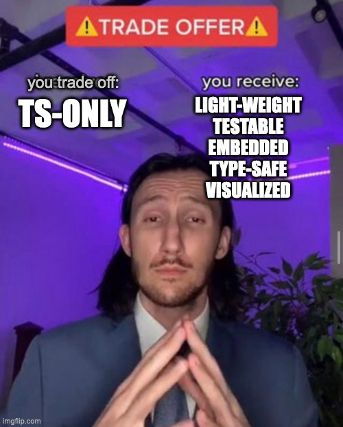

<div style="float: right; margin: 1em">

</div>

# Gamgee

An embedded framework to lend you a helping durable execution hand on your journey.


## Philosophy



This is being built to be lightweight, testable, localized/embedded and as type safe as I can make it, with a visual and single source of truth for how the workflow is built.

Workers should expect an influx of requests, and it’s preferable they be persistent and durable (can get an item, work on it, get the next item, etc.). Steps/tasks should be a single(?) idempotent IO call. The classic use case is when you have a streaming-like business flow, but a streaming framework like Kafka Streams is overkill.

# WARNING: DO NOT USE!

This is very much a work in progress. Not even published to npm.

# How To

`// TODO: Build`

# TL;DR Usage

```shell
npm install --save-dev @gamgee/design @gamgee/test
npm install --save @gamgee/run
```

In your package.json:

```json
"scripts": {
  "generate": "mm2ws **/*.mermaid",
}
```

Run:

```shell
npm run generate
```

Fill in the type-checked blanks.

# Features

1. Durable execution of workflows.
2. Workflow is resumable.
3. Multiple steps.
4. Decision steps (_do I execute X or Y next?_)
5. OpenTelemetry support (each step is a span)
6. DAG only (detect cycles)

# Examples

See [the examples directory](./packages/run/docs/examples) for a list of examples ordered by increasing complexity.