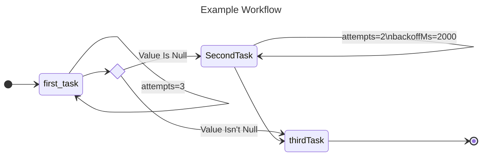

<div style="float: right; margin: 1em">

</div>

# Gamgee

An embedded framework to lend you a helping durable execution hand on your journey.

# WARNING: DO NOT USE!

This is very much a work in progress. Not even published to npm.

# TL;DR Usage

```shell
npm install --save-dev @gamgee/design @gamgee/test
npm install --save @gamgee/run
```

In your package.json:

```json
"scripts": {
  "generate": "mm2ws **/*.mermaid",
}
```

Run:

```shell
npm run generate
```

Fill in the type-checked blanks.

# Example

1. Prepare your workflow as a Mermaid State Diagram:

_src/my-workflow.mermaid_
```text
---
title: Example Workflow
---

stateDiagram-v2
    direction LR

    state POST_FIRST_TASK <<choice>>

    [*] --> first_task
    first_task --> first_task: attempts=3
    first_task --> POST_FIRST_TASK
    POST_FIRST_TASK --> SecondTask: Value Is Null
    SecondTask --> SecondTask: attempts=2\nbackoffMs=2000
    POST_FIRST_TASK --> thirdTask: Value Isn't Null
    SecondTask --> thirdTask
    thirdTask --> [*]
```



2. Generate the scaffolding:

```shell
npm run generate
```

_src/my-workflow.generated.ts_
```ts
/* This file is automatically generated. It gets overwritten on build */
import {CompleteWorkflow, WrongTimingError, WorkflowBase} from "@gamgee/run";
import {JSONValue} from "@gamgee/interfaces/json";
import {StateStore} from "@gamgee/interfaces/store";
import {WorkflowTask} from "@gamgee/interfaces/task";

import {FirstTaskPayload, SecondTaskPayload, ThirdTaskPayload} from "./my-workflow";

export type PostFirstTaskDecision = {
    decision: 'Value Is Null',
    targetTaskName: 'SecondTask',
    payload: SecondTaskPayload,
} | {
    decision: 'Value Isn\'t Null',
    targetTaskName: 'thirdTask',
    payload: ThirdTaskPayload,
};

export abstract class ExampleWorkflowBase extends WorkflowBase {
    protected constructor() {
        super('ExampleWorkflow');
        
        super._registerStep({ name: 'first_task', run: this.firstTask, attempts: 3, backoffMs: 1000 });
        super._registerStep({ name: 'SecondTask', run: this.secondTask, attempts: 2, backoffMs: 2000 });
        super._registerStep({ name: 'thirdTask', run: this.thirdTask, attempts: 1, backoffMs: 1000 });
    }
    
    async submit(payload: FirstTaskPayload, store: StateStore, uniqueTaskId?: string): Promise<void> {
        await super._enqueue('first_task', payload, store, uniqueTaskId);
    }

    abstract firstTask(payload: FirstTaskPayload): Promise<PostFirstTaskDecision>;

    abstract secondTask(payload: SecondTaskPayload): Promise<{ targetTaskName: 'thirdTask', payload: ThirdTaskPayload }>;

    abstract thirdTask(payload: ThirdTaskPayload): Promise<CompleteWorkflow>;    

    protected _registerStep() {
        throw new WrongTimingError();
    }
    
    protected async _enqueue(taskName: string, payload: JSONValue, store: StateStore, taskId?: string): Promise<WorkflowTask> {
        throw new WrongTimingError();
    }
}
```
3. Implement the steps:

_src/my-workflow.ts_

```ts
import {SimpleWorkflowBase} from './my-workflow.generated';
import {CompleteWorkflow} from "@gamgee/run";

export type FirstTaskPayload = string;
export type SecondTaskPayload = { value: string };
export type ThirdTaskPayload = string;

export class ExampleWorkflow extends ExampleWorkflowBase {
    constructor() {
        super();
    }

    async firstTask(payload: FirstTaskPayload): Promise<PostFirstTaskDecision> {
        if (payload === null) {
            return {decision: 'Value Is Null', payload: {value: payload}, targetTaskName: 'SecondTask'};
        }

        return {
            decision: "Value Isn't Null",
            targetTaskName: 'thirdTask',
            payload: payload,
        }
    }

    async secondTask(payload: SecondTaskPayload): Promise<{ targetTaskName: 'thirdTask'; payload: ThirdTaskPayload }> {
        return {
            targetTaskName: 'thirdTask',
            payload: payload.value,
        }
    }

    async thirdTask(payload: ThirdTaskPayload): Promise<CompleteWorkflow> {
        return CompleteWorkflow;
    }
}
```

4. Now you can submit and run a workflow instance:

```ts
const workflow = new ExampleWorkflow();
const store = // Choose where you'd like workflow state to be persisted
await workflow.submit('test', store);

const worker = new WorkflowWorker();
const result = await worker.executeWaitingWorkflow(
    store,
    { workflowType: workflow.workflowType },
    1000
);

```