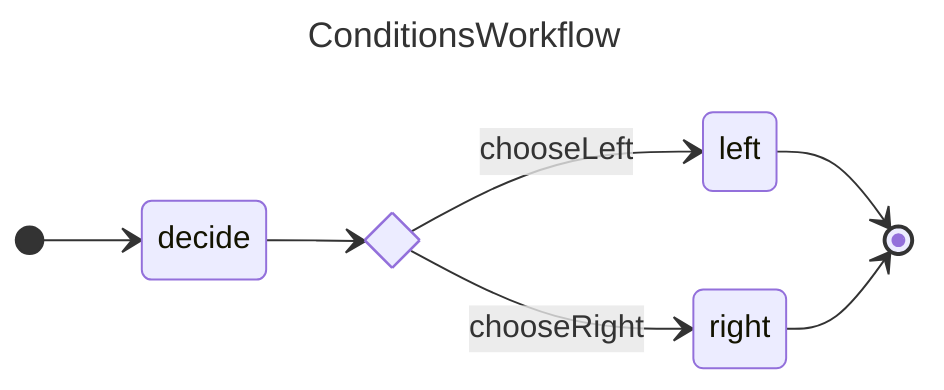

A workflow with a decision between going with the left or right branches.

[[Diagram Source](./conditions.mermaid)] [[Generated Scaffold](./conditions.generated.ts)] [[Implementation](./conditions.ts)]