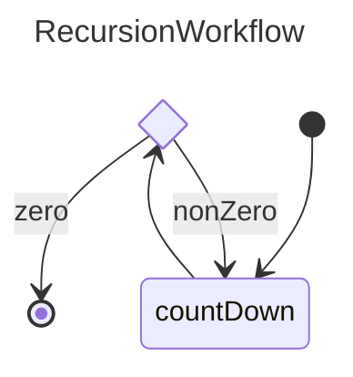

```mermaid
---
title: RecursionWorkflow
---

stateDiagram-v2
    direction TB
    state decision <<choice>>

    [*] --> countDown
    countDown --> decision
    decision --> [*]: zero
    decision --> countDown: nonZero
```

A workflow counting down recursively.

[[Diagram Source](./recursion.mermaid)] [[Generated Scaffold](./recursion.generated.ts)] [[Implementation](./recursion.ts)]