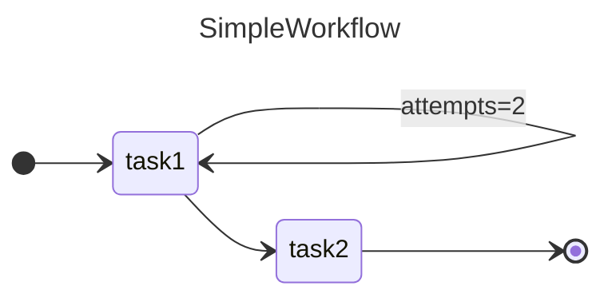

```mermaid
---
title: SimpleWorkflow
---

stateDiagram-v2
    direction LR
    [*] --> task1
    task1 --> task1: attempts=2
    task1 --> task2
    task2 --> [*]
```

A simple workflow with two steps.

[[Diagram Source](./simple-workflow.mermaid)] [[Generated Scaffold](./simple-workflow.generated.ts)] [[Implementation](./simple-workflow.ts)]